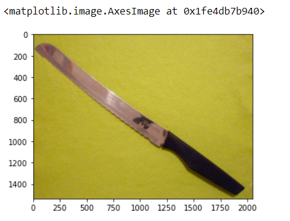
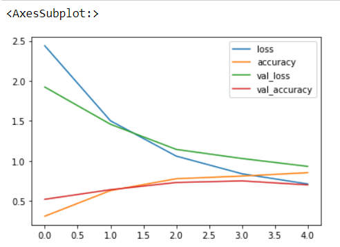
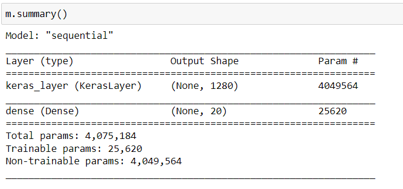

# SA(a) KITCHEN UTENSIL CLASSIFIER
# Algorithm
1. Import the necessary packages.
2. Read the image.
3. use tensor flow to perform certainj classes.
4. epoch is used to find accuracy.
5. using the classes we can find the array.
6. using pandas plot graph for the image.

## Program:
```
/*
Program to implement 
Developed by   : S.Sham Rathan
RegisterNumber : 212221230093  
*/
1. CODE :
import splitfolders  # or import split_folders
splitfolders.ratio("Raw", output="output", seed=1337, ratio=(.9, .1), group_prefix=None) # default values
import matplotlib.pyplot as plt
import matplotlib.image as mping
img = mping.imread("output/val/BREAD_KNIFE/breadkniferaw2.jpg")
plt.imshow(img)
import tensorflow as tf
from tensorflow.keras.preprocessing.image import ImageDataGenerator
train_datagen = ImageDataGenerator(rescale=1./255,
    rotation_range=0.2,
    width_shift_range=0.2,
    height_shift_range=0.2,
    horizontal_flip=True,
    zoom_range=0.2)
test_datagen = ImageDataGenerator(rescale=1./255)
train = train_datagen.flow_from_directory("output/train/",target_size=(224,224),seed=42,batch_size=32,class_mode="categorical")
test = train_datagen.flow_from_directory("output/val/",target_size=(224,224),seed=42,batch_size=32,class_mode="categorical")
from tensorflow.keras.preprocessing import image
test_image = image.load_img('output/val/BREAD_KNIFE/breadkniferaw2.jpg', target_size=(224,224))
test_image = image.img_to_array(test_image)
test_image = tf.expand_dims(test_image,axis=0)
test_image = test_image/255.
test_image.shape
import tensorflow_hub as hub
m = tf.keras.Sequential([
hub.KerasLayer("https://tfhub.dev/tensorflow/efficientnet/b0/feature-vector/1"),
tf.keras.layers.Dense(20, activation='softmax')
])
m.compile(loss=tf.keras.losses.CategoricalCrossentropy(),optimizer=tf.keras.optimizers.Adam(),metrics=["accuracy"])
history = m.fit(train,epochs=5,steps_per_epoch=len(train),validation_data=test,validation_steps=len(test))
classes=train.class_indices
classes=list(classes.keys())
m.predict(test_image)
classes[tf.argmax(m.predict(test_image),axis=1).numpy()[0]]
import pandas as pd
pd.DataFrame(history.history).plot()
m.summary()
```

## OUTPUT:




### VIDEO YOUTUBE LINK:
```
https://youtu.be/ehOBSf-GwUA
```